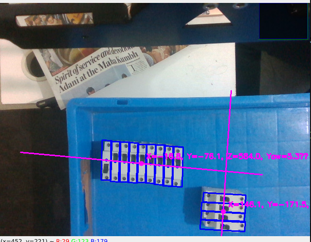
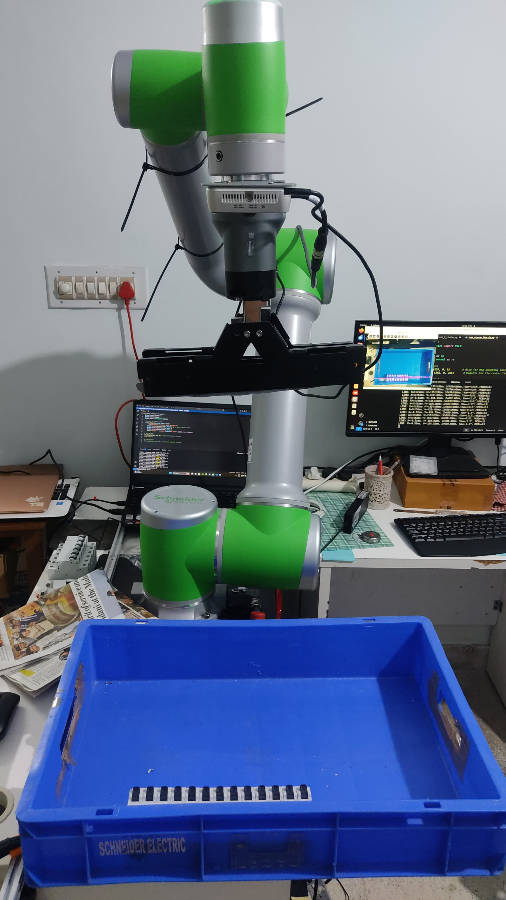

```markdown
# Schneider Electric Cobot Project

This project involves training a Schneider Electric collaborative robotic arm to detect and pick up MCBs (Miniature Circuit Breakers) and trays. Below is an overview of the workflow and the technologies used.

## Project Workflow

1. **Data Collection**: 
    - Captured images of MCBs and trays using a RealSense Depth Camera D435.
    - Manually annotated the images to create a labeled dataset.

2. **Data Augmentation**:
    - Applied algorithms to generate additional annotated images, increasing the dataset size and diversity.

3. **Model Training**:
    - Trained a YOLOv8 Nano model for object detection to identify MCBs and trays in the images.

4. **Position Extraction**:
    - Detected MCBs and calculated their exact positions (XYZ coordinates and yaw angle) using the depth camera.

5. **Robotic Arm Control**:
    - Used the extracted position data to guide the robotic arm to pick up the MCBs and trays.

## Technologies Used

- **Hardware**: Schneider Electric Cobot, RealSense Depth Camera D435
- **Software**: YOLOv8 Nano, Custom Annotation Tools
- **Programming Languages**: Python, C++

## Images

Below are some images from the project:

### Data Collection


### Annotated Images


### Model Detection




### Robotic Arm in Action


## Results

The trained YOLOv8 Nano model successfully detected MCBs and trays with high accuracy. The robotic arm was able to pick up the objects efficiently based on the extracted position data.

## Future Work

- Improve the model's accuracy with more diverse datasets.
- Optimize the robotic arm's movement for faster operation.
- Explore additional use cases for the cobot in industrial automation.

## Acknowledgments

Special thanks to Sapienrobotics.ai and the team for giving me the Opportunity to work on this project.

---

```